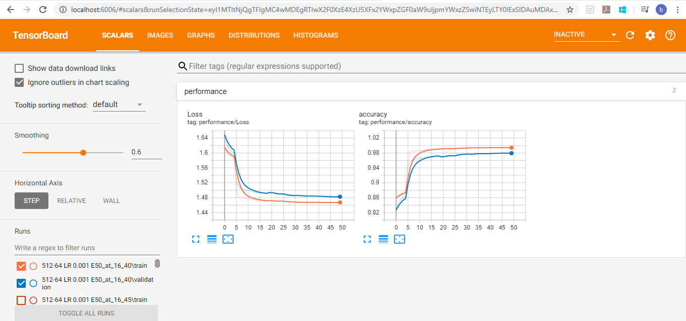
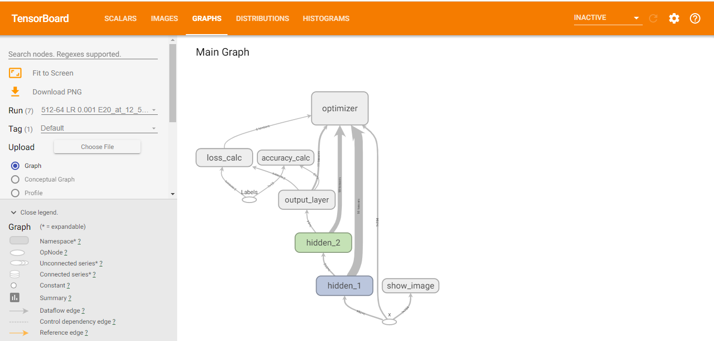
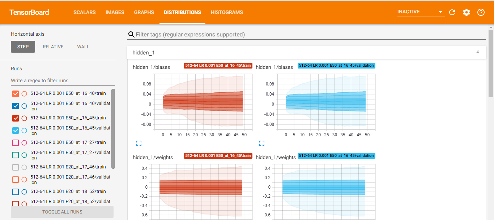
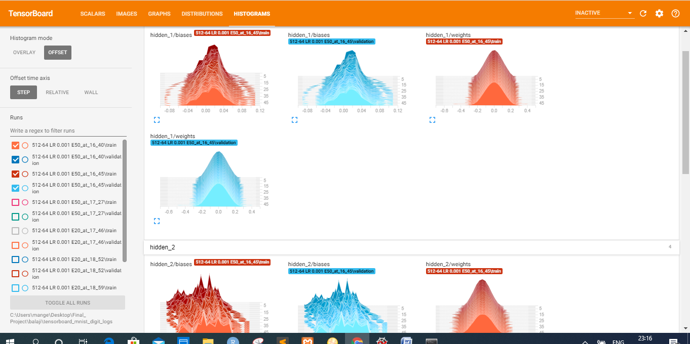

# Hand-Written-Digits-Recognition-Using-tensor-flow-neural-networks-Tensorboard-image-recognition

<h3>INTRODUCTION:</h3>
<h4>Python Deep Learning </h4>
To make machines more intelligent, the developers are diving into machine learning and deep learning techniques. A human learns to perform a task by practicing and repeating it again and again so that it memorizes how to perform the tasks. Then the neurons in his brain automatically trigger and they can quickly perform the task they have learned. Deep learning is also very similar to this. It uses different types of neural network architectures for different types of problems.
 <h4>For example</h4> – object recognition, image and sound classification, object detection, image segmentation, etc.
<h3>Hand Written Digits Recognition:</h3>
The handwritten digit recognition is the ability of computers to recognize human handwritten digits. It is a hard task for the machine because handwritten digits are not perfect and can be made with many different flavours. The handwritten digit recognition is the solution to this problem which uses the image of a digit and recognizes the digit present in the image.
In this project I am going to predict the hand written digit images using tensor flow and use tensorboard to see the weight bias accuracy and loss metricsand graphs.

<h3>EXPLANATION OF CODE</h3>

see the file DOCUMENT.doc

<h3>SOME SNIPPETS OF TENSOR BOARD</h3>
<h4>ACCURACY & LOSS</h4>

<h4>GRAPHS(NODES & EDGES)</h4>

<h4>DISTRIBUTION</h4>

<h4>WEIGHTS AND BIAS</h4>

